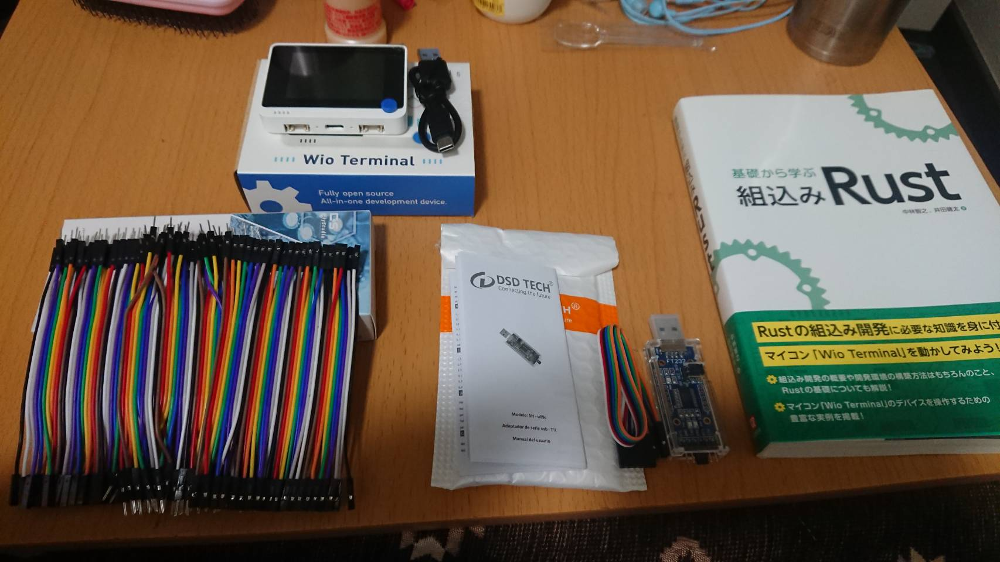
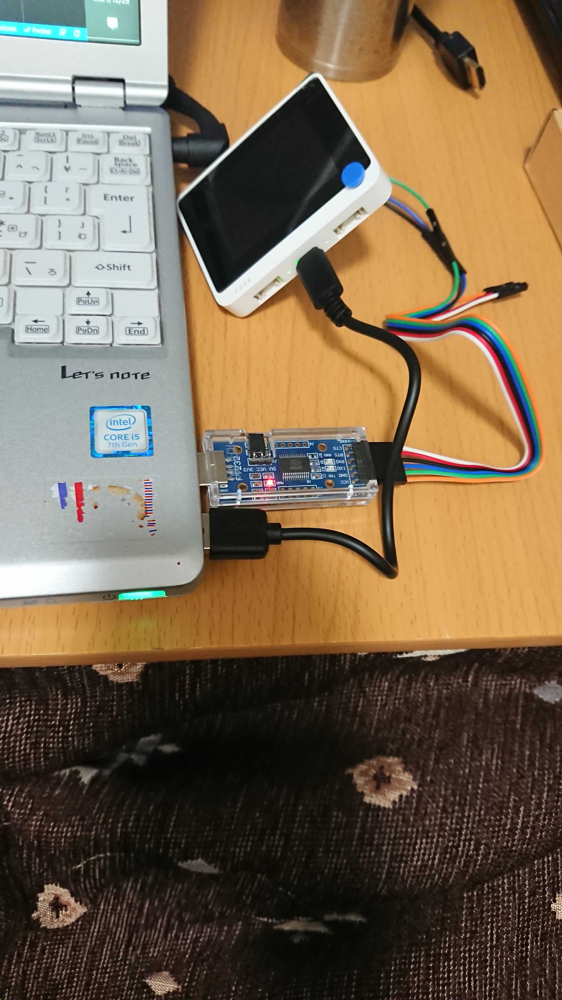

# embedded-using-wio_terminal
『基礎から学ぶ 組込みRust』を試してみる(Rust and Go)

### Wio Terminal
- [Wio Terminalをはじめよう](https://wiki.seeedstudio.com/jp/Wio-Terminal-Getting-Started/)
  - [回路図](https://files.seeedstudio.com/wiki/Wio-Terminal/res/Wio-Terminal-SCH-v1.2.pdf)
  - [ATSAMD51P19A データシート](https://ww1.microchip.com/downloads/en/DeviceDoc/SAM_D5x_E5x_Family_Data_Sheet_DS60001507G.pdf)

## Rust
- [サポートサイト](https://github.com/tomoyuki-nakabayashi/Embedded-Rust-from-Basics)

- P251で使う「SDL2.dll」のパス
  - C:\Users\lbfde\Downloads\SDL2-devel-2.0.18-VC.zip\SDL2-2.0.18\lib\x64

- Windows(powershell)で実施

- `C:\DEV\workspace\GO\src\github.com\ddddddO\embedded-using-wio_terminal\rust\wio-examples` 配下で、`make xxxx` でサンプル実行できる。以下が出来た。
  - WioTerminal(UART送信機能) -> シリアルターミナル(TeraTerm)でhello worldを出力(`make 6-3-uart`)
  - シリアルターミナル(TeraTerm):文字列入力 -> (UART受信機能) WioTerminal (UART送信機能) -> シリアルターミナル:文字列出力 (`make 6-3-echo`)

## Go
- [Go Conference 2021 Autumn 内の Wio Terminal を使った TinyGo ハンズオン用の記事](https://github.com/sago35/tinygo-workshop)

## 素材
- 
- 
